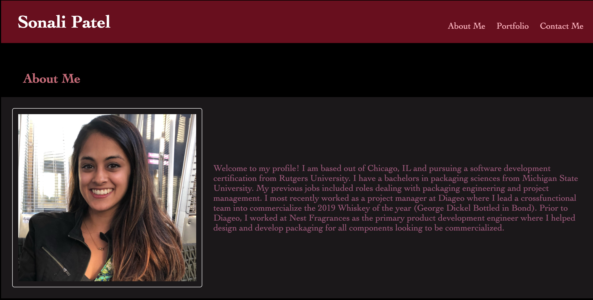
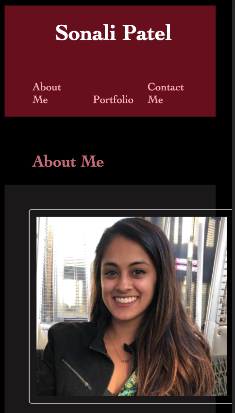

# Portfolio-Sonali

Welcome to my portfolio! This is the homepage of all my software development work.  

## Description

Created as our 1st project in the Rutgers software development bootcamp, this portfolio will serve as the main repositpry for all my major projects. 
Projects currently referenced in the portfolio are out dated abd used to fill space. 

## Links

#### Site: 

https://patelso9.github.io/Portfolio-Sonali/

#### Git Repository: 

https://github.com/Patelso9/Portfolio-Sonali

## Visuals

### Web View

### Mobile View

## Support

You can reach out to sonali.patel.pkg@gmail.com with any questions or comments. 

## Status

This portfolio is still a work in progress. No class projects have been added to the site yet. 
